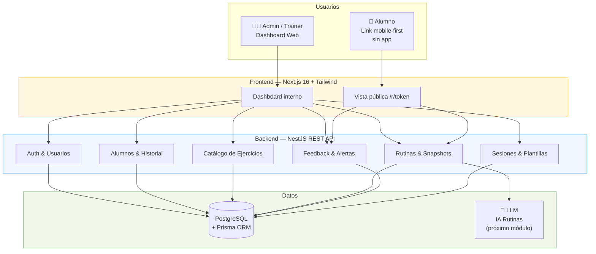
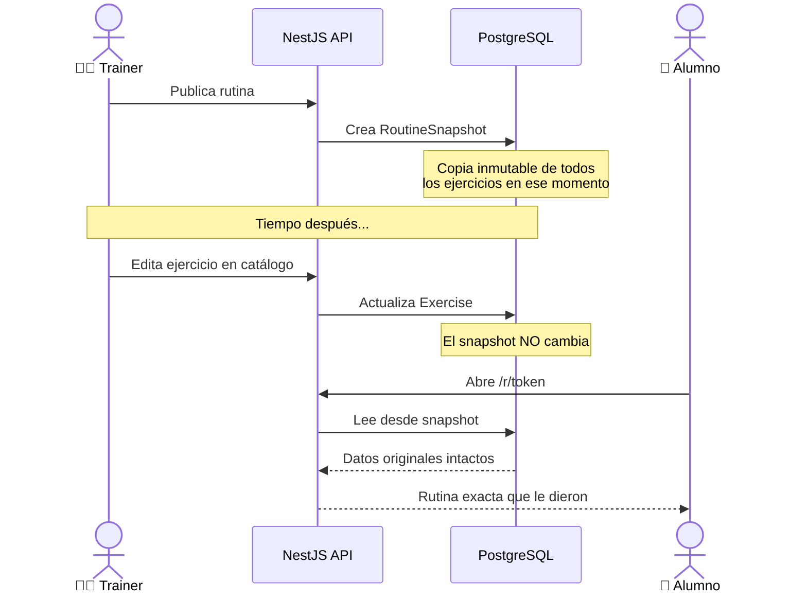
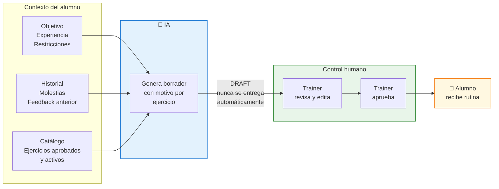
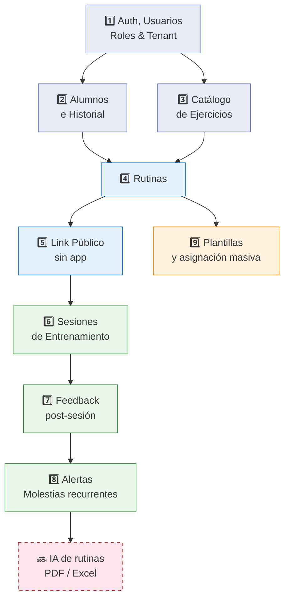
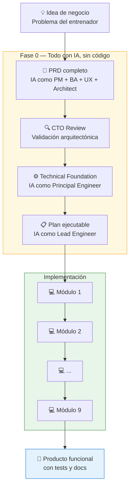
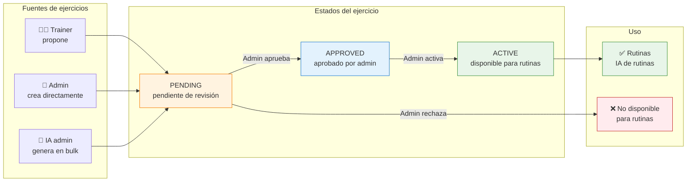

# Diagramas para posts de LinkedIn

## Cómo usarlos

1. Entrá a **mermaid.live**
2. Borrá el código de ejemplo
3. Pegá el bloque del diagrama que querés
4. Click en el ícono de descarga → PNG o SVG
5. Listo para subir a LinkedIn

---

## Diagrama 1 — Arquitectura general
### Para: post-03 (arquitectura) y post-01 (viaje con IA)

---

## Diagrama 2 — Snapshot pattern
### Para: post-06 (snapshot) y post-03 (arquitectura)

---

## Diagrama 3 — Filosofía de IA
### Para: post-02 (filosofía IA)

---

## Diagrama 4 — Los 9 módulos
### Para: post-05 (9 módulos)

---

## Diagrama 5 — El viaje con IA
### Para: post-01 (viaje con IA) y post-07 (documentación)

---

## Diagrama 6 — Catálogo cerrado de ejercicios
### Para: post-02 (filosofía IA) o post-03 (arquitectura)

---

## Tips de exportación

- **Fondo blanco:** en mermaid.live, antes de exportar activá la opción "White background"
- **Tamaño LinkedIn:** el formato ideal para imagen de post es 1200 × 627 px. Podés escalar el PNG en cualquier editor de imágenes gratuito (Canva, Photopea, etc.)
- **Si querés agregar tu nombre o logo:** pegá el PNG exportado en Canva y agregale un margen con tu nombre abajo
